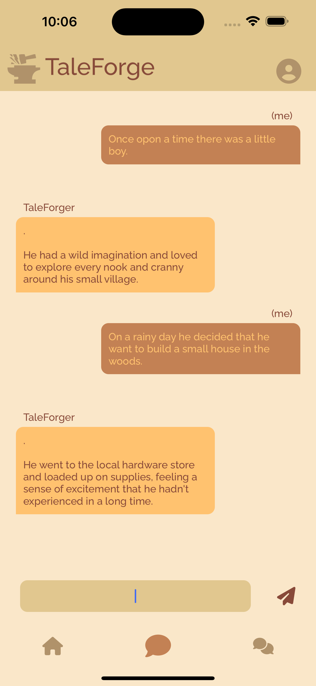
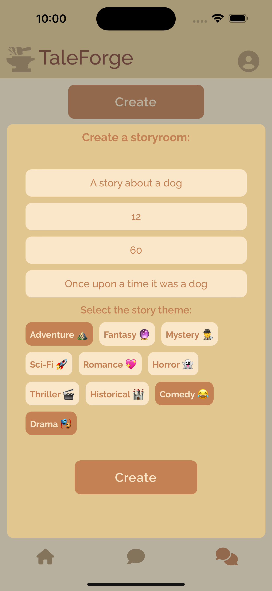
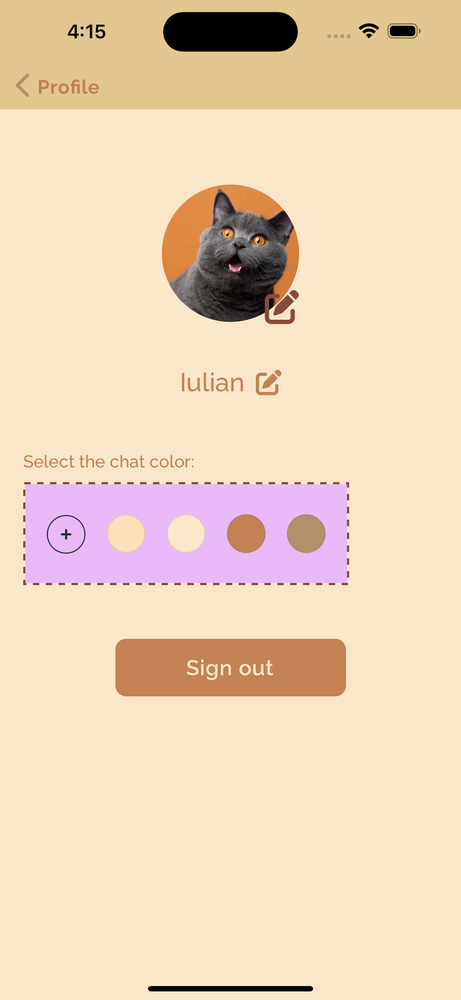

# TaleForge

> 📚 Welcome to TaleForge - where stories come alive! Create your own tales using our AI-powered bot or collaborate in real-time with friends. Join our vibrant community and immerse yourself in the world of storytelling! 🌟✨ #TaleForge #UnleashYourStory"

### Authentication

>The app leverages Firebase authentication, offering users a seamless and user-friendly registration and login experience. While anonymous usage is an option, creating an account provides enhanced features and benefits.

> The registration process includes the security step of receiving a verification code via email, made seamless through the integration of [EmailJS API](https://www.emailjs.com/docs/rest-api/send/).

### Home

> On the home page, users gain access to various available story rooms, providing the option to join any of them

### Solo-Chat

>In the solo chat feature, users craft stories alongside our bot, TaleForger, using the OpenAI API for generating lines. 

### Duo-Chat

> In the Duo-Chat feature, users can conveniently access all ongoing chats they're part of, while also having the option to create new ones for others to join. 

### Chat Room

> Upon selecting any available story room, users gain access to chat with their designated friend. Engage in storytelling by exchanging one message per day until the countdown concludes. This gradual interaction allows for a captivating storytelling experience, where each message contributes to the evolving narrative between friends.

### Profile

>Presently, on the profile page, users can access a color picker feature that enables them to personalize the chat by changing its color. Tailor the chat interface to your preferences by selecting from a spectrum of colors, adding a touch of individuality to your storytelling experience!

## Anonymously Account

>When opting for anonymous mode, the user's access is limited to the solo chat and the profile, where a registration form is available. However, if the user chooses to register, all data from the solo chat is saved, ensuring continuity and preservation of their storytelling endeavors within the app.

#### Foot note:
> The above presentation is the version beta, it has some bugs here and there and some side functionality and UI improvements on the way.